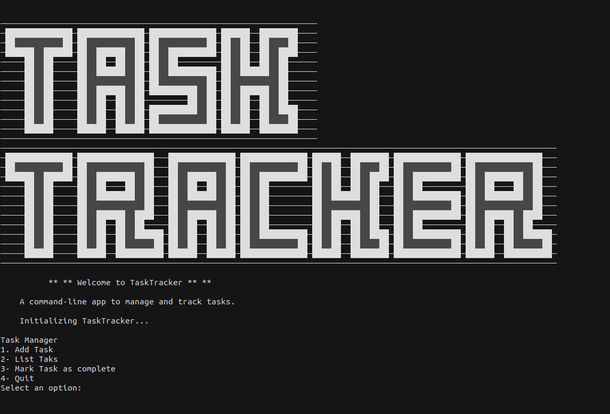

# TaskManager - Command-Line Task Management Project

TaskManager is a command-line task management project created as a practical exercise for the "Git for Professionals Tutorial" by freeCodeCamp. This project focuses on hands-on learning and application of Git best practices, including better commit practices, branching strategies, and effective collaboration using Git features.

## Features

- **Efficient Task Management:** TaskManager allows you to create, update, and manage tasks right from your terminal.

- **Version Control Mastery:** This project serves as a playground for mastering Git best practices, including meaningful commits, branching strategies.

- **Develop and Feature Branches:** TaskManager follows the "develop" and "feature" branching model for organized collaboration, fostering smooth integration of new features.

## GitHub Best Practices Showcased

- **Meaningful Commits:** Each commit follows the best practices for commit messages, ensuring clarity and context.

- **Branching Strategy:** TaskManager demonstrates how to create and manage feature branches, and how to effectively merge them into the "develop" branch.


## Getting Started

1. Clone the repository to your local machine.
   
   ```sh 
   git clone git@github.com:Ayoubbooob/TaskTracker.git
   ```

2. Navigate to the project directory.
    
    
    ```sh
    cd TaskTracker
    ```

3. Run TaskTracker to manage your tasks.

    ```sh
    python3 taskmanager.py
    ```
    


## Credits

This project is a result of dedicated practice and learning through the **"Git for Professionals Tutorial"** by freeCodeCamp.

Course Video: [Git for Professionals Tutorial](https://www.youtube.com/watch?v=Uszj_k0DGsg&t=236s)

---

Feel free to use and modify this project as a practical playground to enhance your Git skills and to explore GitHub's best practices!